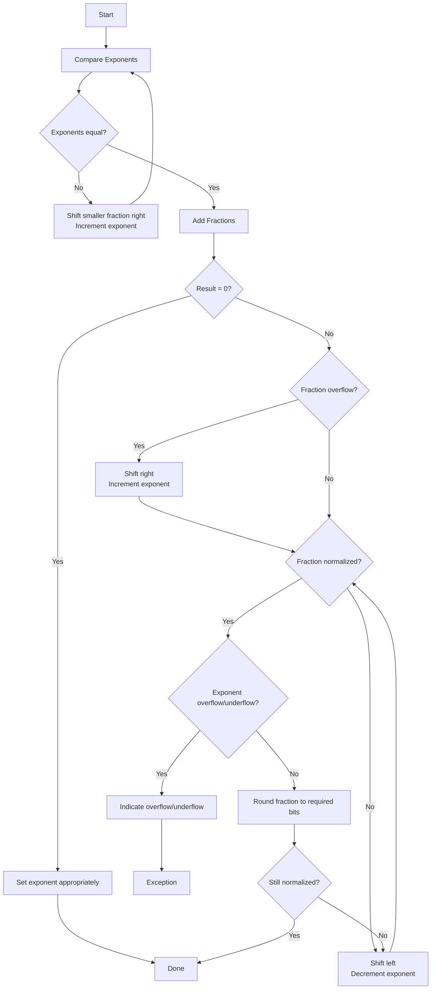

# Floating Point Addition

To perform floating point addition, consider two floating point numbers will be added to form a floating point sum.
`(F1 * 2^E1) + (F2 * 2^E2) = F * 2^E`

Numbers to be added are properly normalized. In order to add two fractions, associated exponents are equal. Thus if exponents E1 and E2 are different, we must have to unnormalize one of the functions and adjust the exponent accordingly. The smaller number is one that should be adjusted so that if signifies digits are lost, effect is not significant.

**Example**

To illustrate the process, i am adding `F1 * 2^E1 = 0.111 * 2^5` and `F2 * 2^E2 = 0.101 * 2^3`

Since E2 is not equal to E1, we unnormalize the smaller number F2 by shifting right two times, and adding 2 to the exponent
`0.101 * 2^3 = 0.0101 * 2^4 = 0.00101 * 2^5`

***Note that*** shifting right one place is equivalent to dividing by 2, so each time i have to shifti have added 1 to the exponent to compensate. When the exponents are equal, add the fractions
`(0.111 * 2^5) + (0.00101 * 2^5) = 01.00001 * 2^5`

This addition caused an ***overflow*** into the sign bit position, so i have to shift right and add 1 to the exponent to correct the fraction ***overflow***. The final result is
`F * 2^E = 0.100001 * 2^6

When one of the fractions is negative, the result of adding fractions may be unnormalized, as illustrated in the following example:
(1.100 * 2^(-2)) + (0.100 * 2^(-1))
= (1.110 * 2^(-1)) + (0.100 * 2^(-1)) (after shifting F1)
= 0.010 * 2^(-1) (result of adding fractions is unnormalized)
= 0.100 * 2^(-2) (normalized by shifting left and subtracting 1 from exponent)	

**In summary**, the steps required to carry out floating-point addition are as follows:
1. Compare exponents. If the exponents are not equal, shift the fraction with the smaller exponent right and add 1 to its exponent; repeat until the exponents are equal.
2. Add the fractions (significands).
3. If the result is 0, set the exponent to the appropriate representation for 0 and exit.
4. If fraction overflow occurs, shift right and add 1 to the exponent to correct the overflow.
5. If the fraction is unnormalized, shift left and subtract 1 from the exponent until the fraction is normalized.
6. Check for exponent overflow. Set overflow indicator, if necessary.
7. Round to the appropriate number of bits. Is it still normalized? If not, go backto step 4.

---

Below flowchart illustrates this procedure graphically. An optimization can be added to step 1. We can identify cases where the two numbers are vastly different. If E1 .. E2 and F2 is positive, F2 will become all 0s as we right shift F2 to equalize the exponents. In this case, the result is F 5 F1 and E 5 E1, so it is a waste of time to do the shifting. If E1 .. E2 and F2 is negative, F2 will become all 1s (instead of all 0s) as we right shift F2 to equalize the exponents. When we add the fractions, we will get the wrong answer. To avoid this problem, we can skip the shifting when E1 .. E2 and set F 5 F1 and E 5 E1. Similarly, if E2 .. E1, we can skip the shifting and set F 5 F2 and E 5 E2.

---

For the 4-bit fractions in our example, if |E1 2 E2| . 3, we can skip the shifting. For IEEE single precision numbers, there are 23 bits after the binary point; hence, if the exponent difference is greater than 23, the smaller number will become 0 before the exponents are equal. In general, if the exponent difference is greater than the number of available fractional bits, the sum should be set to the larger number. If E1 .. E2, set F 5 F1 and E 5 E2. If E2 .. E1, set F 5 F2 and E 5 E2. 

---
Inspection of this procedure illustrates that the following hardware units are required to implement a floating-point adder:
- Adder (subtractor) to compare exponents (step 1a)
- Shift register to shift the smaller number to the right (step 1b)
- ALU (adder) to add fractions (step 2)
- Bidirectional shifter, incrementer/decrementer (steps 4, 5)
- Overflow detector (step 6)
- Rounding hardware (step 7)

Many of these components can be combined. For instance, the register that stores the fractions can be made a shift register in order to perform the shifts. The register that stores the exponent can be a counter with increment/decrement capability. Below diagram shows a hardware arrangement for the floating-point adder. The major components are the exponent comparator and the fraction adder. Fraction addition can be done using 2’s complement addition. It is assumed that the operands are delivered on an I/O bus. If the numbers are in a signed-magnitude form as in the IEEE format, they can be converted to 2’s complement numbers and then added. Special cases should be handled according to the requirements of the format. The sum is written back into the addend register in below diagram.

