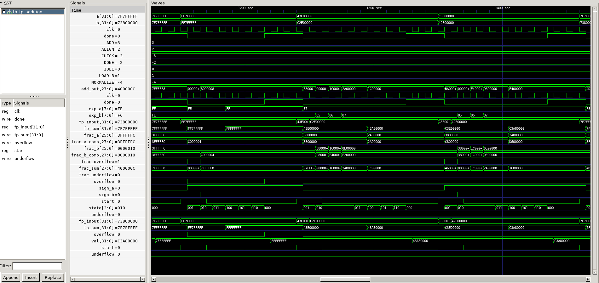

# 🧮 Floating Point Addition (IEEE-754)


---

## 📌 Overview

This project implements a **32-bit IEEE-754 Floating Point Addition Unit** in Verilog.  
The design follows a **Finite State Machine (FSM)** based approach to perform floating-point addition.

---

## ⚙️ Features

- IEEE-754 single precision (32-bit)
- FSM-based architecture
- Handles exponent, alignment, and exponent addition
- Normalization and rounding
- Overflow / Underflow detection
- Linted & formatted using Verible
- Simulated and passed so many test cases

---

## 🏗️ Project Structure

```
.
├── docs/
│   ├── floating_point_numbers.md
│   └── floating_point_addition.md
├── rtl/
│   ├── fp_addition.v
│   └── tb_fp_addition.v
├── sim/
│   ├── dump.vcd
│   ├── simulated_output.txt
│   ├── testcase.md
│   └── waveform.png
├── README.md
└── LICENSE
```

## 🧹 Linting & Formatting

This project uses **Verible** for linting and formatting Verilog code.

This project follows industry-style RTL coding practices with automated linting and formatting.  
Code quality is verified before simulation to ensure clean and maintainable design.

### 🔍 Linting
```bash
verible-verilog-lint fp_addition.v
verible-verilog-lint tb_fp_addition.v
verible-verilog-format fp_addition.v
verible-verilog-format --replace fp_addition.v // To remove unwanted spaces
verible-verilog-format tb_fp_addition.v
verible-verilog-format --replace tb_fp_addition.v // To remove unwanted spaces
```
---
## 🧪 Testcase
Covered all testcase


## 📊 Simulation Waveform

The waveform demonstrates correct FSM transitions and IEEE-754 floating-point addition behavior including alignment, normalization, and exception handling.



---

## 📄 License

This project is licensed under the MIT License.

© 2026 Asim Khan (asim-asic)
